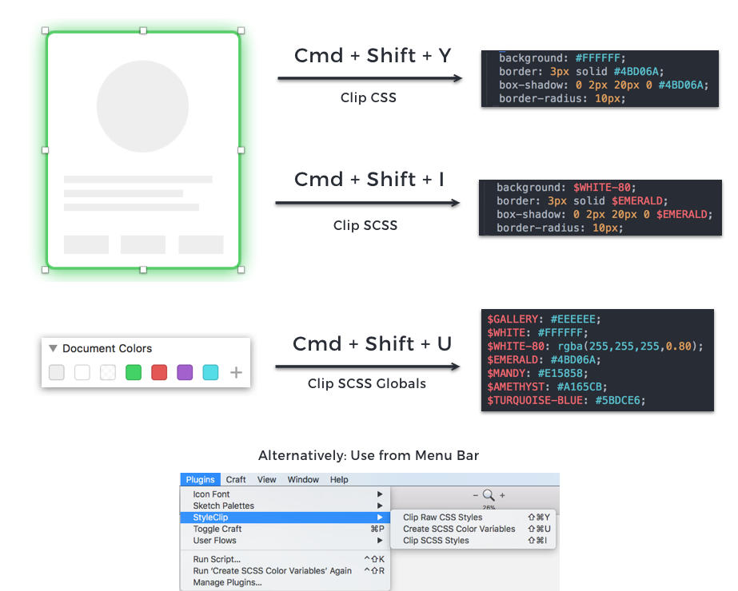

# StyleClip

A nimble Sketch plugin that allows copying an element's styles directly to your Mac clipboard. It supports clipboarding raw CSS styles, SCSS variable definitions and styles with SCSS variables.



## Installation

Move StyleClip.sketchplugin into your Plugins folder in Sketch or double-click StyleClip.sketchplugin

## Usage

You can use the plugin by selecting StyleClip from the Plugins dropdown in the menu bar or using these keyboard shortcuts:

* **Cmd + shift + y**: Clip Raw CSS Styles - Copy raw CSS associated with this element
* **Cmd + shift + u**: Clip SCSS Globals - Generates and copies SCSS colors associated used in the current mockup
* **Cmd + shift + i**: Clip SCSS Styles - Copy SCSS styles associated with this element

Make sure that when using this plugin, you are selecting the root (bottom) element containing all the styles that you wish to copy. Selecting layers (folders with contents) might not copy you the styles you want.

## Info

### SCSS Conventions

* SCSS Variables are capitalized
* RGBA colors are postfixed with a dash and their percentage opacity. For example, `$WHITE-80: rgba(255,255,255,0.80);`
* Colors that occupy the same variable due to being very close in hex value are postfixed with an index based on their ordering within document color. For example:

```
$TURQUOISE-BLUE: #5BDCE6;
$TURQUOISE-BLUE1: #5CDCE6;
$TURQUOISE-BLUE2: #5DDCE6;
```

If you have differing SCSS preferences, feel free to fork this plugin and adapt it to your own needs.

### Contributions & Credits

This project was inspired by wanting to reduce the keystrokes necessary when moving from Sketch mockups to SCSS, particularly when having to re-reference colors and variables due to forgetting their names.

Feel free to drop me a line on twitter to [@liawesomesaucer](https://twitter.com/liawesomesaucer) if you have a question or contribution.

Thanks to Chirag Mehta's project [Name that Color Javascript](http://chir.ag/projects/ntc) for color naming functionality.
